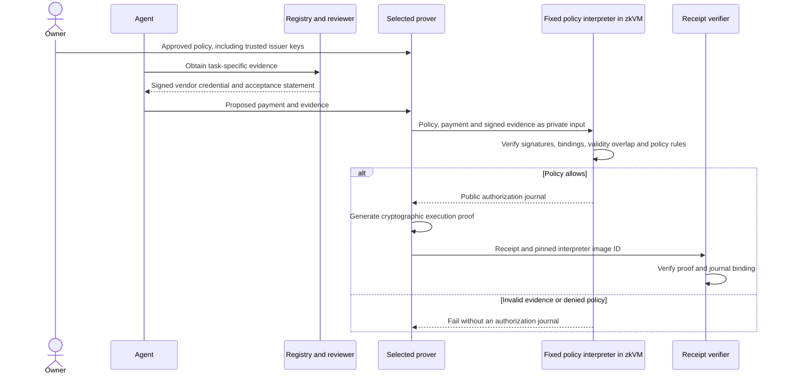

# Warrant policy interpreter

An owner approves **policy data and evidence authorities**. An agent proposes a
payment. A fixed Rust interpreter authenticates the evidence, evaluates the
policy, and emits an authorization. A RISC Zero guest proves that execution.

See [the detailed data-flow diagram](data-flow.md) for actor responsibilities,
privacy boundaries and contract enforcement.
The [evidence checker](evidence-checker.md) admits agent-extracted invoice
facts only when they can be re-derived or checked deterministically.

Invoice evidence checker (2026-09-23): `evidence::authorize_invoice` parses a
UBL 2.1 invoice, admits agent line claims only with checkable evidence, and
returns Allow, Ask or a denial through a verified three-valued evaluator. Its
14-word journal is settled by [`InvoiceEscrow`](invoice-escrow.md) either by a
proof from a separate invoice guest or, below a threshold, by the buyer-run
signer (`warrant-host invoice-sign`). See [the design](evidence-checker.md) and
[recorded results](verified/verification-results.md).

The implementation includes reusable [policy templates](templates/README.md),
issuer signing tools, a fixed Rust interpreter with a Verus-proved evaluator,
RISC Zero proofs, a revocable payment vault, and a [committed task escrow](task-escrow.md).
The escrow locks the approved policy commitment, recipient, amount and deadlines;
the agent explicitly accepts those terms before work. Proof generation and
submission need no administrative role.

Validation before the evidence checker: 28 Rust tests, 32 Solidity tests
(including a real verifier), 7 Verus obligations and 8 mutation checks pass. See
the [validation record](validation-results.md) for scope and reproduction. The
evidence checker raises the Verus result to 16 obligations and 14 rejected
mutations and adds 21 native tests; see [its record](verified/verification-results.md).

See [contract deployment instructions](contracts/README.md) and the local demo
below. Public-network deployment is separate from local verification; no Arc
contract address is claimed here.

Unlike the [separate Circom prototype](../proof-execution/), this version can
change rule combinations and accept dynamically chosen recipients without changing
the interpreter program. This is a typed policy DSL, not natural-language execution
or a Lean-proved specification. The rule evaluator now has a
[Verus correctness proof](verified/README.md); the surrounding authorization
pipeline remains outside that proof.

## First supported request

> Pay a registered contractor up to 100 USDC after our designated reviewer accepts
> the specified deliverable.

The owner selects the registry and reviewer public keys and approves this rule:

```json
{
  "all": [
    "accepted",
    { "amount_at_most": 100000000 },
    { "vendor_category_in": [7, 9] }
  ]
}
```

The amount is in token base units; the application must establish that the chosen
token has six decimals before displaying it as USDC. Categories are the registry's
defined IDs, not a model's guesses. Available rules are `all`, `any`,
`amount_at_most`, `vendor_category_in`, `accepted`, `deliverable_equals`, and
`recipient_equals`; the invoice path adds `line_labels_within`, `no_denied_term`
and `within_po`, which `authorize()` rejects. Empty combinations, unknown operations, zero categories,
excessive nesting and oversized rules fail closed. The maximum is 128 nodes,
8 nested levels, 16 children per combination and 64 category entries.

## How the fixed interpreter works

`Rule` in `verified/src/lib.rs`, re-exported by `core`, is a typed expression tree.
`authorize()` validates that tree, verifies the evidence signatures and bindings,
and calls `matches()` to project authenticated facts into the shared, verified
`evaluate()` function. Only an allowed
request produces an `Authorization`. The guest reads the input, calls this same
function and commits the authorization's bytes to its public journal.

The guest binary's image ID identifies the interpreter; `policy_hash()` separately
commits to the user's rule tree, parameters, issuer keys and scope. For example,
changing an amount limit or adding an `any` branch changes the policy commitment
without changing the interpreter image. Adding a new operation changes the guest
program and requires approving a new image. The owner must review policy meaning;
the agent cannot supply a replacement evaluator under the existing image ID.

Verus proves that `evaluate()` matches the declarative rule semantics for every
rule tree and facts value. This is a source-level proof of the evaluator, not a
proof of `authorize()`, cryptographic dependencies or the owner's interpretation.
See the [verification scope and reproducible checks](verified/README.md).

Every accepted request must have authentic registry and reviewer evidence, even if
its rule does not require an affirmative `accepted` result. A policy omitting that
predicate can authorize a negatively reviewed task: owner review of rule meaning
is essential. Policy evaluation does not repair an overly permissive policy.

## Evidence and trust

The registry signs a credential containing the recipient, vendor category, payment
domain and validity interval. The reviewer signs a task-specific statement
containing the task ID, deliverable hash, recipient, amount, acceptance result,
domain and validity interval. The interpreter verifies both secp256k1 signatures
using the owner-approved keys and requires the evidence to match the request.

The statement proved is **"the specified reviewer signed acceptance and the policy
allows this payment"**, not **"the work objectively satisfies every user intent"**.
A future test-runner or document checker can replace or supplement reviewer
attestation, but it is not implemented here. The authorities must prevent the same
business obligation from being assigned multiple payable task IDs.

The owner approves the issuer keys before the agent chooses a recipient. This
permits new registered contractors without owner approval of every address. A
compromised registry or reviewer remains a source-integrity risk; proof validity
does not establish an honest issuer. Immediate credential revocation is not yet
implemented; validity windows and policy rotation are the current design controls.

## Proof flow and privacy



The CLI currently runs the prover and verifier locally. Separate agent/prover
services and an owner approval UI are not implemented. The prover sees the private
policy and evidence; the blockchain verifier does not need those inputs. Public
outputs include recipient, amount, task and deliverable identifiers, payment
domain, policy version/hash, validity bounds and evidence commitment. This is not
payment anonymity. Policy commitments are unsalted, so small policy spaces may be
guessable even when their parameters are omitted from the journal.

The guest image ID pins the interpreter code. The policy hash pins its input
parameters, trusted keys and rule tree. Supported policy changes produce a new
policy hash, not a new guest image. Adding new interpreter operations changes
the image and requires an explicit application upgrade.

## Build and test

Install Rust and [RISC Zero's `rzup`](https://dev.risczero.com/api/zkvm/install).
The tested component versions are:

```sh
rzup install rust 1.88.0
rzup install r0vm 3.0.5
cd warrant/policy-execution
cargo test -p warrant-policy --locked
cargo build -p warrant-host --release --locked
```

Both workspace and guest `Cargo.lock` files are included. The guest declares its
Rust 1.88 minimum and uses dependency resolution compatible with that toolchain.
Use `RISC0_BUILD_LOCKED=1` for builds that must reject guest-lock changes.

The guest pins RISC Zero's `k256`, `sha2` and `crypto-bigint` accelerator patches
to exact commits, following its [ECDSA example](https://github.com/risc0/risc0/tree/v3.0.5/examples/ecdsa/k256).
The native interpreter keeps ordinary RustCrypto implementations. Guest execution
tests compare the resulting authorizations and exercise forged-signature rejection;
this is behavioral testing, not a formal equivalence proof.

The following commands create **synthetic local fixtures**, execute the guest,
generate real succinct receipts and verify them. They move no funds and do not
demonstrate customer traction. Fixture keys are public test keys, not wallet keys.

```sh
mkdir -p artifacts
cargo run -q -p warrant-policy --example fixture > artifacts/request.json
cargo run -q -p warrant-policy --example fixture -- alternative > artifacts/alternative.json
target/release/warrant-host execute artifacts/request.json
RAYON_NUM_THREADS=4 target/release/warrant-host prove artifacts/request.json artifacts/request.receipt
RAYON_NUM_THREADS=4 target/release/warrant-host prove artifacts/alternative.json artifacts/alternative.receipt
target/release/warrant-host verify artifacts/request.receipt
cargo test -p warrant-host --release --test execution -- --test-threads=1
cargo test -p warrant-host --release --test receipts -- --ignored
```

`execute` checks guest execution but does not produce a cryptographic proof.
`prove` produces a succinct receipt, independently verifies it against the pinned
guest image and checks its journal against native evaluation. It refuses to
overwrite output receipts. `RISC0_DEV_MODE` and fake receipts are rejected.
After changing the guest, generate receipts in a fresh directory; earlier-image
receipts will fail verification. The receipt tests accept an absolute
`WARRANT_RECEIPT_DIR` containing both input JSON files and their matching receipts.
No remote proving service is configured; keep witness files private if they ever
contain real business data. The first proof may download public prover assets.

Proof segments default to at most `2^18` cycles to limit peak memory consumption.
`WARRANT_SEGMENT_PO2` accepts values from 16 through 20; lower values reduce segment
memory at the cost of more segments. Four Rayon workers are recommended for the
local commands above. These settings affect proof generation, not policy semantics
or the interpreter image. The original unoptimized run caused heavy swapping on
this machine; do not assume that proof generation has the same resource footprint
as ordinary guest execution.

## Templates, signing and payment integration

Use `warrant-policy instantiate` to turn a reviewed template and explicit
parameters into a concrete policy; `warrant-policy hash` lets both parties verify
the commitment. See [template and issuer signing commands](templates/README.md).
`warrant-evidence` signs registry and reviewer statements on the issuer's machine.
It does not decide whether work is satisfactory.

For a spending vault, the customer approves the policy with `setPolicy()` and
retains cancellation, pause and withdrawal powers. For committed work, use
`TaskEscrow.offer()`: funding reserves the full payment, the designated recipient
accepts, and the customer cannot then change terms or withdraw that reservation.
Only valid proof settlement or the agreed timeout releases it. See the
[escrow lifecycle, journeys and refund rules](task-escrow.md).

A prover converts a succinct receipt into Groth16 with `warrant-host wrap`, then
exports the seal and journal with `export-evm`. The contract checks the exact
policy/payment/domain against stored authorization and calls the pinned verifier.
The prover has no discretionary spending authority.

`Authorization::journal()` emits twelve Solidity-ABI words in this exact order:

```text
policyHash, chainId, vault, token, recipient, amount, taskId, deliverableHash,
policyVersion, validAfter, validUntil, evidenceHash
```

The vault checks the pinned interpreter image, active policy/domain, current
block time and budget, consumes the task ID across policy versions, and transfers
atomically. The escrow binds the same journal to its accepted task and reservation. A verified
receipt by itself is not permission to spend: the interpreter cannot know current
chain authorization, spent budget or whether the task has already been paid.

This is not a formal proof that the interpreter matches the owner's intent or is
free of bugs. Native tests cover authentication, evidence substitution, changed
recipients, amount limits, policy composition, scope isolation, bounded policy
size, validity intersections and journal encoding. The explicit receipt tests
check different policies against one image and reject altered public outputs or
an incorrect image ID. Review and deployment-specific verification remain required.

The policy and evidence commitment encoding is length-delimited, domain-separated
bincode 1.3 serialization of typed structures followed by SHA-256. JSON formatting
does not change the commitment. Changes to that schema or serialization version
are interpreter changes and must not silently reuse an old approval.

## Reproduce deployment and real settlement locally

Prerequisites: the Rust/RISC Zero toolchains above, Foundry (`forge`, `cast`,
`anvil`), Python 3, Node/npm, and running Docker for Groth16 wrapping. Local wrapping
uses RISC Zero's `risczero/risc0-groth16-prover:v2025-04-03.1` x86 image; on Apple
Silicon the demo selects `linux/amd64`. Allow several minutes and sufficient RAM
and disk for proving. All demo keys and funds are synthetic.

```sh
# From policy-execution/
npm ci --prefix contracts --ignore-scripts
python3 scripts/local-demo.py
```

The script starts its own loopback-only Anvil, deploys a test token, runs the
same `contracts/script/Deploy.s.sol` used for deployment, instantiates a template,
funds and accepts a task, generates and wraps a real proof, settles through an
independent relayer, checks balances and rejects replay. It shuts down Anvil on
exit and leaves inputs, receipts, EVM export, deployment records and `result.json`
in a fresh `artifacts/escrow-*/` directory. `--deploy-only` checks deployment,
funding and acceptance without claiming proof settlement.

For external networks, follow [the deployment procedure](contracts/README.md).
Construct policies only after knowing the deployed escrow address. Share policy
JSON with the agent, verify its commitment, and leave time for evidence issuance,
proving and transaction inclusion before `settleBy`.

## Complete validation

Generate the two distinct policy receipts using the earlier commands, and keep
the EVM export from the local demo. Supply absolute paths below:

```sh
RISC0_BUILD_LOCKED=1 WARRANT_RECEIPT_DIR=/absolute/path/to/receipts \
  cargo test -p warrant-policy -p warrant-host --release --locked -- \
  --include-ignored --test-threads=1
cd contracts
WARRANT_EVM_FIXTURE=/absolute/path/to/artifacts/escrow-run/evm.json forge test
forge fmt --check src test script
cd ..
python3 verified/verify.py --verus /absolute/path/to/verus --mutations
git diff --check
```

The receipt directory must contain `request.json`, `alternative.json` and their
matching `.receipt` files. `WARRANT_EVM_FIXTURE` must be inside `artifacts/` under
the configured Foundry read permission. Without that variable, the real verifier
test uses the checked-in synthetic proof fixture. A fresh demo proves the current
build and validates actual escrow settlement. See
[recorded validation evidence](validation-results.md) for results and limitations.
