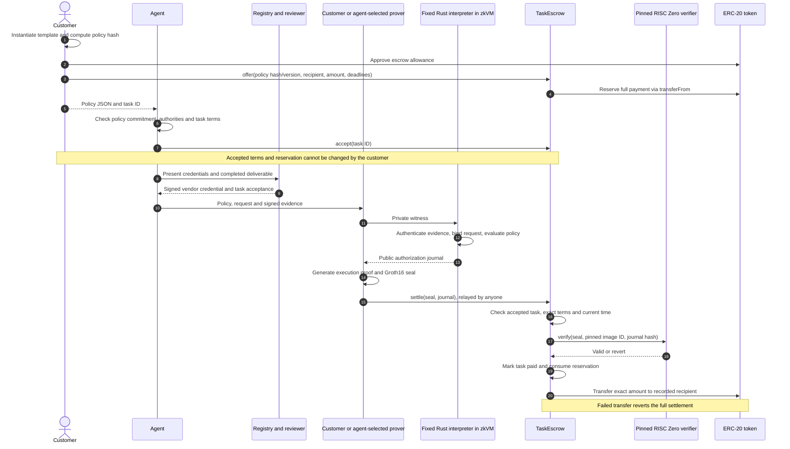

# Policy execution: actors, evidence and settlement

The customer selects a reviewed template, fills its parameters and approves the
resulting concrete policy commitment. The agent receives the policy data and
checks it against the on-chain agreement before accepting work.

## Enforcement and ownership

The contract records the policy commitment, version, fixed recipient/amount and
acceptance/settlement deadlines. It independently enforces those terms. Rule
semantics and evidence validation execute in the fixed interpreter; the proof
binds the result to the exact committed policy and payment journal.

The escrow has no administrator, upgrade or emergency withdrawal. Refund before
acceptance is customer-controlled; after acceptance it requires the agreed
settlement timeout. This secures conditional payment, not unconditional payment
for work that never obtains the required evidence. See the
[complete state diagram and timeout boundaries](task-escrow.md).

The separate spending vault intentionally supports revocation, budget changes,
pause and customer withdrawals. It is suitable for revocable delegation rather
than an agent's committed task agreement.

## What is proved

Verus proves that the shared evaluator follows its mathematical rule semantics.
RISC Zero proves execution of the pinned guest, including signature and request
binding checks. Neither establishes that a reviewer is honest or that the policy
captures natural-language intent. The Solidity contracts and surrounding Rust
pipeline are tested, not formally verified.

## Privacy and availability

The prover sees the full policy and signed evidence. In the escrow workflow the
agent also receives the policy so it can review its agreement. Public observers
see the recipient, amount, domain, task/deliverable hashes, policy hash/version,
evidence hash and validity bounds. This is not payment anonymity; unsalted policy
commitments can reveal low-entropy policies through guessing.

A customer-operated prover is optional, not a security authority. An agent with
the policy and evidence can prove independently. A prover or reviewer can withhold
service; proof validity does not provide liveness or prevent acceptance censorship.

## Implementation references

- [Reusable templates and issuer signing](templates/README.md)
- [Policy types, evidence checks and interpreter](core/src/lib.rs)
- [Verus specification and evaluator](verified/src/lib.rs)
- [zkVM guest](methods/guest/src/main.rs)
- [Host proving, wrapping and export](host/src/main.rs)
- [Task escrow](contracts/src/TaskEscrow.sol)
- [Deployment and Arc status](contracts/README.md)
- [Validation results and boundaries](validation-results.md)

This is a CLI/contract implementation. A hosted marketplace, browser approval UI
and managed proving or reviewer services are not implemented.
