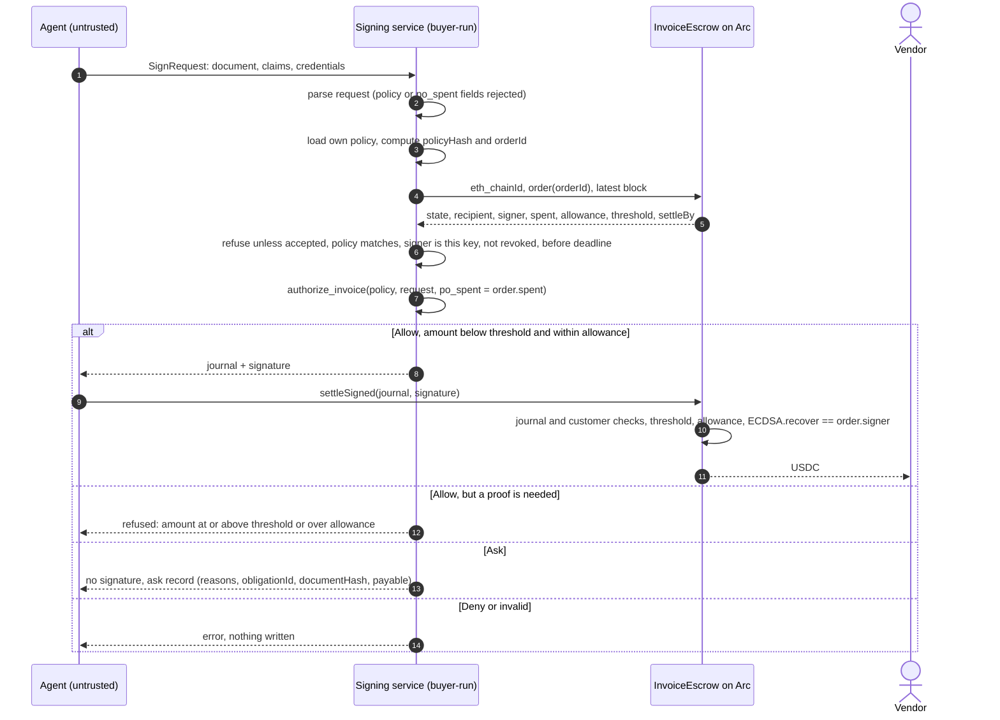
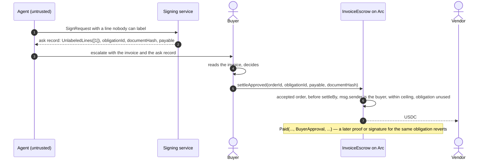

# Invoice escrow

`contracts/src/InvoiceEscrow.sol` settles invoices authorized by the
[evidence checker](evidence-checker.md) against a funded purchase order (PO). It
keeps [`TaskEscrow`](task-escrow.md)'s trust model: no owner, upgrade function,
policy setter, pause authority or administrative withdrawal; one immutable token,
verifier and interpreter image ID per deployment. Everything else is chosen by
the buyer per order, at `offer`, and accepted by the vendor as is. One funded
order backs **many** invoices up to its ceiling, and each invoice settles in one
of three ways, all to the order's accepted vendor:

- **Proof** (`settle`): a RISC Zero receipt for the invoice image, any amount.
  Minutes to produce on a CPU.
- **Signature** (`settleSigned`): the signing service the buyer named for this
  order runs the same interpreter natively and signs the journal. Sub-second, but
  only below the order's `proofThreshold` and within its `signerAllowance`. The
  buyer can `revokeSigner(orderId)` at any time; that only tightens, since proofs
  and approvals still settle.
- **Buyer approval** (`settleApproved`): when the interpreter cannot decide (Ask),
  the buyer pays the invoice on their own authority. Same vendor, same ceiling,
  same deadline, same replay protection; the payment is marked as approved, not
  proven, in the `Paid` event.

## Lifecycle

1. The buyer funds an order with `offer(Terms)`: policy hash and version, order
   number, vendor, ceiling, and the signer terms for this order: `signer`
   address, `signerAllowance` (how much may settle on signatures alone) and
   `proofThreshold` (amounts at or above it need a proof or approval). A zero
   signer means proofs and approvals only; a signer needs a nonzero allowance
   and threshold, and cannot be the vendor. The full ceiling is transferred and
   reserved.
2. The vendor calls `accept(orderId)`. From then on the buyer cannot cancel
   before `settleBy`, so the vendor can deliver against committed funds.
3. For each invoice, one of: the signing service runs `warrant-host invoice-sign`
   and anyone relays `settleSigned(journal, signature)`; a prover runs the invoice
   guest and anyone relays `settle(seal, journal)`; or, for an invoice the checker
   left undecided, the buyer calls `settleApproved(orderId, obligationId, amount,
   documentHash)`. The first two take the same 15-word journal and the same
   checks; only the authenticator differs.
4. After `settleBy`, anyone can `close(orderId)`; the unpaid remainder returns to
   the buyer. An unaccepted order can be closed by the buyer at any time, or by
   anyone after `acceptBy`.

`orderId = keccak256(abi.encode(chainId, escrow, customer, policyHash, poId))`.
`offer` binds `customer` to `msg.sender`; settlement reads it from the authenticated
journal. Another buyer cannot squat this namespace by copying public terms.
`consumed[customer][obligationId]` prevents replay across one buyer's orders and
all three settlement paths without allowing another buyer to block payment.

This is a breaking revision (2026-09-30): `InvoicePolicy.customer` and `InvoicePolicy.invoice_key` are required,
the policy commitment domain is `warrant/invoice-policy/v2`, and the journal
appends customer as its fifteenth word. Rebuild the invoice guest and deploy a
new escrow with its image ID. Old 14-word receipts are not compatible.

## Invoice-source authentication

The buyer includes a compressed secp256k1 public key, `invoice_key`, in the
approved policy. This key belongs to an invoice issuer or trusted intake system.
It is separate in role from the settlement signer. The source must establish
invoice provenance independently; blindly signing any agent-submitted document
would simply move the original vulnerability into that service.

`InvoiceAttestation` contains `scope` (chain, escrow and token), `customer`,
`po_id`, `document_hash` (SHA-256 of the exact XML bytes), `valid_after` and
`valid_until`. The signed message is the domain-separated typed encoding
`warrant/invoice-attestation/v1`. Reformatting XML also changes its hash.

On the authority's machine, using an independently obtained invoice and reviewed
policy/PO files:

```sh
# Construct the statement; default validity is the policy/PO intersection.
# This command checks document/PO bindings, but does not establish source truth.
target/release/warrant-evidence prepare-invoice policy.json po.json invoice.xml statement.json
# Review the statement and document before using the authority's signing key.
target/release/warrant-evidence sign-invoice invoice-authority.key statement.json signature.json
```

The agent places the statement object in `invoice_attestation` and the JSON byte
array from `signature.json` in `invoice_signature` in its `SignRequest`. Neither
command overwrites an existing output. The signing utility is an issuer tool,
not an automatic service exposed to untrusted agents.

The checker requires this evidence before evaluating any rule, including `Any`.
If both fields are absent it returns `Ask(InvoiceAttestationMissing)`. A partial
pair, invalid signature, changed document, wrong customer, wrong PO or wrong
payment scope rejects the request. Its validity interval constrains the journal.
The evidence commitment includes the attestation and signature; checker version
2 identifies these semantics. The contract's signed path still trusts its
settlement signer to run this checker; a compromised signer is bounded by its
on-chain allowance. The proof path verifies execution of the pinned checker.

A source signature establishes endorsement of bytes, not delivery, price
fairness or unique business debt. Buyer approval can override the checker on
the buyer's authority; it does not claim policy compliance.

## The signing service

`warrant-host invoice-sign key.hex policy.json rpc-url request.json output.json`
is the buyer-run service behind the signature path. It is built so that the
untrusted agent cannot feed it anything the checker does not re-verify:

- **What the agent sends** is a `SignRequest`: the invoice bytes, its line
  claims, the vendor credential and purchase order with their signatures, and the
  invoice-source attestation and signature, plus optional reviewer acceptance. The type rejects unknown fields, so a request that
  carries a `policy` or a `po_spent` value fails to parse.
- **What the service holds** is the policy file and the signing key.
- **What the service reads from the escrow**, over JSON-RPC at signing time, is
  the order: its customer, state, policy hash and version, recipient, signer, spend, signer
  allowance and spend, proof threshold, deadline and revocation flag.



The service checks the customer, policy, signer and selected live bounds before
signing. These reads are not an atomic reservation or a settlement guarantee:
state can change, and the contract rechecks authorization at settlement. The `spent`
it feeds the checker is the escrow's, never the agent's, so `WithinPo` is
evaluated against live state on both sides.

### Ask and buyer approval



Approval is bounded like every other path: it pays only the order's vendor, only
within the remaining ceiling, only before the deadline, and consumes the
obligation ID across all paths and orders of the same customer.
The contract does not require evidence of a previous `Ask`; approval is an
explicit buyer override, including for invoices the checker would deny. It is not bounded by the signer allowance or the
threshold, because it is the buyer's own explicit decision with their own key.

## What settlement enforces

| Check | Why |
| --- | --- |
| Journal is exactly 15 words: the 12 `Authorization` words, `poId`, `poMaxTotal`, `customer` | A task-escrow journal cannot be replayed here |
| Order found by `(customer, policyHash, poId)` is Accepted and `settleBy` has not passed | Only committed orders pay |
| `policyVersion`, chain, escrow address, token match | Domain binding |
| `recipient` equals the order's vendor | The invoice cannot redirect payment |
| `poMaxTotal` equals the funded ceiling | The proven order is the funded order |
| `amount ≤ maxTotal − spent` (live state) | The checker's `po_spent` input may be stale; the contract's is not |
| Obligation ID not yet consumed, across the **same customer's** orders and paths | An invoice pays once, even under another order or by another route |
| Nonzero amount, obligation, deliverable and evidence hashes; journal validity window | Well-formed authorization |
| Proof verifies for the pinned invoice image ID (`settle`) | The fixed interpreter produced this journal |
| Signature recovers to the order's `signer` over `signerDigest(journal)` (`settleSigned`) | The buyer's own service produced this journal |
| `amount < proofThreshold`, `amount ≤ signerAllowance − signerSpent`, signer not revoked (`settleSigned`) | Bounds the damage of a stolen signer key to this order's terms |
| `msg.sender` is the order's customer, amount, obligation and document hash nonzero (`settleApproved`) | Only the buyer approves, and the record is complete |

`signerDigest(journal) = sha256("warrant/invoice-signer/v1" ‖ chainId ‖ escrow ‖
sha256(journal))`, computed identically by `evidence::signer_digest` in Rust, so
the checker needs no keccak dependency. Signatures are 65-byte `r‖s‖v`, low-s,
checked with OpenZeppelin `ECDSA.recover`. This is a service key, not a wallet
flow, so EIP-712 typed data is not used.

The rule tree, lexicon, credentials and PO lines stay inside the proven
evaluation; the contract does not interpret them.

## Evidence

- 29 invoice Solidity tests (2026-09-30), including customer-isolation and legacy-journal regressions, including fuzz cases showing cumulative payments never
  exceed the ceiling and signed payments never exceed the allowance; a signer
  named on one order signs nothing for another; buyer approval respects the
  ceiling, the deadline and the shared obligation registry; inconsistent signer
  terms are refused at `offer`.
- `testRustSignatureRecoversToSigner` recovers the signer from a signature the
  Rust helper produced (`contracts/test/fixtures/invoice-signature.json`).
- `testRustJournalDecodesFieldForField` decodes a journal produced by the Rust
  checker (`contracts/test/fixtures/invoice-journal.json`); a Rust test keeps that
  fixture equal to the current encoding.
- Host unit tests pin `orderIdFor`'s layout, the signer address derivation and
  the `order()` decoding the service relies on.
- The Arc probe (`scripts/check-arc.py`) constructs `InvoiceEscrow` in a
  read-only Arc Testnet simulation.
- `scripts/invoice-demo.py` runs the whole flow on a local chain: one invoice
  settled by signature (the service reading the order from the chain), an
  undecided one by buyer approval, and a third by real proof (`--signed-only`
  skips proving). It also shows the service refusing a request that smuggles
  `po_spent` and a key the order does not name.

## Limits

- **Invoice identity.** The obligation ID binds a seller and invoice number, not
  a unique real-world debt. An agent cannot change that number without a new
  invoice-authority signature. The authority can still endorse a reissued or
  false invoice; source honesty and business-level deduplication remain trusted.
- **Signer compromise and availability.** A compromised settlement signer can
  submit arbitrary obligation IDs within an order it can authorize. Consuming
  an ID also blocks it on the same customer's other orders. Allowances bound
  token payments, not that availability impact. Other customers stay isolated.
- **Scope of replay protection.** Consumption is per funding address, not global
  across a company's wallets, deployments or chains. Buyer approval must supply
  the correct obligation ID; the contract cannot derive it from a document hash.
- **Image IDs.** Local guest builds differ across machines. Build with
  `RISC0_USE_DOCKER=1` (see the README) for a reproducible image ID, and deploy
  with that.
- **Unaudited prototype.** Not covered by the Verus proof, which is about the Rust
  evaluator only.
