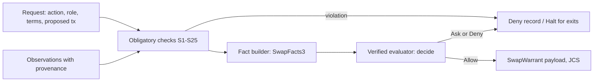

# Swap core: facts, safety checks, chain primitives and warrants

This crate is the deterministic core of the Warrant swap policy signer (step W2
of the [implementation specification](../../swap/implementation.md), for the
[swap specification](../../swap/spec.md)). The agent proposes. This crate decides
what may be signed. It reads no network, no clock and no key: time, chain state
and signed reports are inputs. The policy decision itself is the verified
evaluator of [`swap-verified`](../swap-verified/README.md).



## Modules

| Module | Content |
|---|---|
| `caip` | CAIP-2, CAIP-10 and CAIP-19 parsing; EVM addresses lowercased; `sha256` ids for the evaluator |
| `jcs` | RFC 8785 canonical JSON; rejects floats and integers above 2^53 − 1 |
| `types` | Legs, locks, terms, actions, roles and the nine risk flags |
| `facts` | Provenance, quorum agreement, oracle freshness and confidence, notional, price deviation, transfer fees and the exact gross debit |
| `profile` | Chain profiles, value bands, the obligatory-item check of spec 8.8, reference profiles |
| `ledger` | Period spend, open swaps, consumed swap ids, hashlocks and warrants, policy version, the S25 counter |
| `secret` | The swap secret: caller-supplied CSPRNG, no `Debug`, no `Serialize`, zeroized |
| `bitcoin` | Taproot HTLC template, PSBT version 0, BIP 341 sighashes, lock and spend intent checks, fee limits |
| `evm` | RLP, EIP-1559, the reference HTLC ABI, exact calldata checks, contract and proxy pins |
| `solana` | Legacy and version 0 messages, lookup tables from chain facts, the allowed instruction set per mode, reference HTLC accounts and privileges, PDAs, program pins |
| `tx` | Intent from the terms per family and action; the transaction binding (S24) |
| `checks` | S1 to S25 with fixed reason codes |
| `dsl` | The JSON mini-DSL and `validate_policy` |
| `warrant` | `SwapWarrant`, `DecisionRecord`, payload and hash, the S20 binding check |
| `authorize` | The pipeline: entry actions through the evaluator, exit actions never |

## Decisions in code that the specification leaves open

- Own Bitcoin coins are Taproot key-path outputs, so every signature has a
  BIP 341 sighash that the signer computes itself. Only `SIGHASH_DEFAULT` and
  `SIGHASH_ALL` are accepted.
- PSBT version 0 only; version 2 (BIP 370) is rejected.
- The reference EVM and Solana HTLCs take an absolute time as the timelock.
- The responder's leg needs an absolute timelock: a relative one would start
  at an unknown future confirmation, and S11 could not bound it.
- On Bitcoin, the observation adapter reports the HTLC output. S7 re-derives
  the output script from the terms, which proves `H`, both keys and `T`.
- The notional is known only when both legs have a value. An unknown notional
  takes the strictest value band for S14.
- `authorize` issues no warrant unless the signer runtime supplies a verified
  ACCEPT (`Observations::accept`) whose `terms_hash` equals the hash of the
  proposed terms. The warrant takes `inner_sig_hash` from that evidence.
- A Bitcoin transaction pays at most the profile's worst-case fee for its
  action (`worst_lock`, `worst_claim`, `worst_refund`). The fee is the input
  value minus the output value. The input values come from the PSBT, which is
  safe because every BIP 341 sighash commits to all input amounts.
- A Solana message takes its lookup-table addresses from chain facts
  (`Observations::lookup_tables`), never from the proposal. The HTLC
  instruction must have exactly the reference accounts, in order, with their
  signer and writable flags. A token leg needs the observed token program of
  the mint (`AssetFacts::token_program`).
- Warrant validity windows use the signer's real time in W2.
- A credential for an identity other than the counterparty of the terms is not
  a fact: the counterparty stays unknown.

## Tests

```sh
cargo test -p warrant-swap-core
python3 swap-core/check_mutations.py        # every check is load-bearing
cargo build -p warrant-swap-core --target wasm32-unknown-unknown
```

- Cross-checks: the Taproot output, txids and BIP 341 sighashes (key path and
  script path) against `rust-bitcoin`; PDAs against the Solana SDK.
- `tests/pipeline.rs`: a BTC/USDC swap from both sides, every action, and the
  fault-injection tests 1, 2, 3, 5, 6, 7, 8 and 10 of spec 13.3. Tests 4 and 9
  need the signer runtime (W3).
- `check_mutations.py` disables each check in `src/checks.rs` in turn and
  requires a failing test. S1 is also enforced by the type (`HashAlg` has only
  `Sha256`).

Results on 2026-10-06: 56 unit tests and 22 pipeline tests passed; 18 of 18
disabled checks caught; the wasm32 build succeeds.
