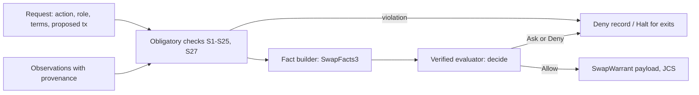

# Swap core: facts, safety checks, chain primitives and warrants

This crate is the deterministic core of the Warrant swap policy signer (step W2
of the [implementation specification](../../swap/implementation.md), for the
[swap specification](../../swap/spec.md)). The agent proposes. This crate decides
what may be signed. It reads no network, no clock and no key: time, chain state
and signed reports are inputs. The policy decision itself is the verified
evaluator of [`swap-verified`](../swap-verified/README.md).



## Modules

| Module | Content |
|---|---|
| `caip` | CAIP-2, CAIP-10 and CAIP-19 parsing; EVM addresses lowercased; `sha256` ids for the evaluator |
| `jcs` | RFC 8785 canonical JSON; rejects floats and integers above 2^53 − 1 |
| `types` | Legs, locks, terms, actions, roles and the nine risk flags |
| `facts` | Provenance, quorum agreement, oracle freshness and confidence, notional, price deviation, transfer fees and the exact gross debit |
| `profile` | Chain profiles, value bands, the obligatory-item check of spec 8.8, reference profiles |
| `ledger` | Period spend, open swaps, consumed swap ids, hashlocks and warrants, the newest accepted policy (version and hash, S22), the S25 counter |
| `secret` | The swap secret: caller-supplied CSPRNG, no `Debug`, no `Serialize`, zeroized |
| `bitcoin` | Taproot HTLC template, PSBT version 0, BIP 341 sighashes, lock and spend intent checks, fee limits |
| `evm` | RLP, EIP-1559, the reference HTLC ABI, exact calldata checks, contract and proxy pins |
| `solana` | Legacy and version 0 messages, lookup tables from chain facts, the allowed instruction set per mode, reference HTLC accounts and privileges, PDAs, program pins |
| `tx` | Intent from the terms per family and action; the transaction binding (S24) |
| `checks` | S1 to S25 and S27 with fixed reason codes; `code::ALL` lists every code |
| `dsl` | The JSON mini-DSL and `validate_policy` |
| `warrant` | `SwapWarrant`, `DecisionRecord`, payload and hash, the S20 binding check |
| `authorize` | The pipeline: entry actions through the evaluator, exit actions never |

## Decisions in code that the specification leaves open

- Own Bitcoin coins are Taproot key-path outputs, so every signature has a
  BIP 341 sighash that the signer computes itself. Only `SIGHASH_DEFAULT` and
  `SIGHASH_ALL` are accepted.
- PSBT version 0 only; version 2 (BIP 370) is rejected.
- The reference EVM and Solana HTLCs take an absolute time as the timelock.
- Leg B needs an absolute timelock. Every entry action of both parties denies a
  relative one (`TIMELOCK_FORM`), so the initiator never locks leg A for such
  terms. A relative leg A timelock counts from the confirmation of the lock. At
  accept and at the initiator's lock, the lock does not exist yet, so `T_A`
  counts from the block after the observed tip: the earliest confirmation. At
  the responder's lock, S13 computes `T_A` from the observed lock. A lock read
  at block `h` with `k` confirmations is in block `h + 1 − k`, and BIP 68 allows
  the refund from that block plus the count. The adapter's timelock must equal
  `T_A`. A lock read above the observed tip denies, because the tip is then
  stale. The observation height of a lock fact is the block at which the
  provider read the lock and counted its confirmations. A relative time is not
  supported: no observation carries its BIP 68 base. At `reveal`, the
  initiator computes `T_A` from its own observed leg A lock in the same way;
  without that observation, the `timeout_gap` fact stays unknown.
- On Bitcoin, the observation adapter reports the HTLC output. S7 re-derives
  the output script from the terms, which proves `H`, both keys and `T`.
- The notional is known only when both legs have a value. An unknown notional
  takes the strictest value band for S14.
- A missing price never goes to the owner as `Ask`. When the evaluator returns
  `Ask` and the rule reads an unknown notional or price deviation, the trade is
  denied (`PRICE_UNKNOWN`). An `Allow` that holds for every price stays.
- On Bitcoin the leaf keys decide who can spend. S5 and S6 require the claim key
  of the counterparty leg and the refund key of the own leg to be own keys
  (`OwnAccounts::bitcoin_keys`).
- S11 adds `D_refund(B)`, the time for the leg B refund to become final after
  `T_B`, because a claim stays valid until then. A profile sets it to 0 only
  with `claim_closes_at_timelock`, which a Bitcoin profile can never set. The
  profile states the failure probability of its clock bounds, and a Bitcoin
  profile has at least six settle blocks for time locks.
- S27 runs before `lock` for the own receiver on the counterparty leg and the
  own `refund_to` on the own leg, and again before `reveal`. An EVM token must
  block neither the payee nor the HTLC and must not be paused. A Solana payee
  needs its associated token account for the leg mint under SPL Token or
  Token-2022, initialized, not frozen and without required memos, and the mint
  must not be paused. Once the paying lock exists (the responder's lock, the
  reveal), its escrow token account must not be frozen. Bitcoin and native
  coins need no facts. The receiver facts must come from the observed tip of
  the leg chain or a later block; a stale report is no fact.
- A signed Bitcoin transaction never waits. A lock or a claim has an
  `nLockTime` that is final now (0, or a height at or below the observed tip)
  and no relative lock on any input (bit 31 of `nSequence` set). An absolute
  refund has an `nLockTime` from `T` up to the observed tip, of the kind of `T`
  (a time lock: exactly `T`), and an `nSequence` below `0xFFFFFFFF` with bit 31
  set. A relative refund has `nSequence` exactly `T` and a final `nLockTime`.
- An observed Bitcoin lock must carry its output script and outpoint. S7
  compares that script with the derivation from the terms; nothing else proves
  `H`, both keys and `T` on chain.
- `authorize` issues no warrant unless the signer runtime supplies a verified
  ACCEPT (`Observations::accept`) whose `terms_hash` equals the hash of the
  proposed terms. The warrant takes `inner_sig_hash` from that evidence.
- A Bitcoin transaction pays at most the profile's worst-case fee for its
  action (`worst_lock`, `worst_claim`, `worst_refund`). The fee is the input
  value minus the output value. The input values come from the PSBT, which is
  safe because every BIP 341 sighash commits to all input amounts.
- A Solana message takes its lookup-table addresses from chain facts
  (`Observations::lookup_tables`), never from the proposal. The HTLC
  instruction must have exactly the reference accounts, in order, with their
  signer and writable flags. A token leg needs the observed token program of
  the mint (`AssetFacts::token_program`).
- Warrant validity windows use the policy signer's real time. The S20 check
  `check_binding` compares the window with the verifier's real time and a
  stated skew allowance. It accepts `valid_after − skew ≤ now_real ≤
  valid_until + skew`. It rejects an inverted window and a skew above
  `MAX_SKEW_SECS` (60 seconds).
- On Solana, S7 reads the account at the escrow PDA. A lock that the signer
  relies on (the responder's check of leg A, the reveal, the claim) needs an
  account that the HTLC program owns. Its data must start with
  `ESCROW_DISCRIMINATOR`, which is `sha256("account:Escrow")[..8]`. Before the
  own lock, the address can hold no account or only lamports: a System-owned
  account without data. Anyone can send lamports to an address, so this case
  must not block the lock. A Solana program pin means the reference HTLC
  interface, including this account layout.
- S22: the ledger keeps the version and the `policy_hash` of the newest
  accepted policy. A higher version passes. The same version passes only with
  the same hash. A lower version is denied, also when the signer accepted it
  before. Before the first accepted policy, every policy passes. A ledger
  snapshot without the `policy` field does not load. S22 does not read the S25
  counter yet, like S4, S10 and S21: the signer runtime must detect a lost
  ledger (W3).
- `reasons` in a warrant or a decision record holds only fixed codes from
  `checks::code::ALL`. A failed check gives its code. When S13 wraps another
  check, the record also gives the code of that check (for example
  `S13_ENTRY_WINDOW` and `S7_CONTRACT_IDENTITY`). The detail of a failed check
  can contain text from the terms. It stays in `Outcome::diagnostic`, which is
  not part of the record. Never sign, store or show it as a reason. An
  `S8_FORBIDDEN_RISK_FLAG` record does not name the flag (G24 moves these flags
  to S9).
- Terms that do not encode as JCS halt an exit action and deny an entry action,
  like a missing ACCEPT.
- A credential for an identity other than the counterparty of the terms is not
  a fact: the counterparty stays unknown.

## Tests

```sh
cargo test -p warrant-swap-core
python3 swap-core/check_mutations.py        # every check is load-bearing
cargo build -p warrant-swap-core --target wasm32-unknown-unknown
```

- Cross-checks: the Taproot output, txids and BIP 341 sighashes (key path and
  script path) against `rust-bitcoin`; PDAs against the Solana SDK.
- `tests/pipeline.rs`: a BTC/USDC swap from both sides, every action, and the
  fault-injection tests 1, 2, 3, 5, 6, 7, 8 and 10 of spec 13.3. Tests 4 and 9
  need the signer runtime (W3). A BTC for SOL variant covers the Solana escrow
  account (S7). Every negative test checks that each reason is a fixed code.
- `check_mutations.py` disables each check in `src/checks.rs` in turn and
  requires a failing test. S1 is also enforced by the type (`HashAlg` has only
  `Sha256`).

Results on 2026-10-07, after D3, D7, D8, D9 and G2: 79 unit tests and 40
pipeline tests passed; 21 of 21 disabled checks caught; the wasm32 build
succeeds. Manual mutations of each new rule that the script cannot reach (the
ledger hash rule, the validity window, the escrow states, the call sites in
`authorize`, the relative `T_A` arithmetic and the reason codes) each fail a
test.

Results on 2026-10-07, after the n-block clock model, `D_refund` and S27: 64
unit tests and 30 pipeline tests passed; 19 of 19 disabled checks caught; the
wasm32 build succeeds.

Results on 2026-10-06: 56 unit tests and 22 pipeline tests passed; 18 of 18
disabled checks caught; the wasm32 build succeeds.
