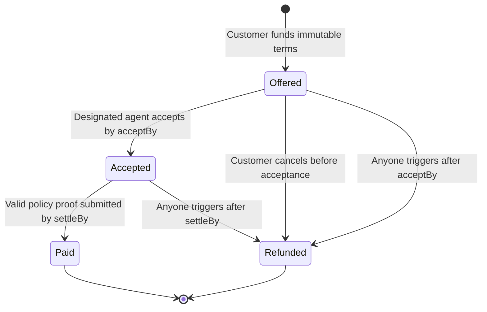

# Committed task escrow

## Implemented scope

`contracts/src/TaskEscrow.sol` adds fixed-price task agreements alongside the
revocable `PolicyExecutionVault`. The escrow has no owner, upgrade function,
policy setter, pause authority, or administrative withdrawal. Each deployment
pins one token, verifier address and interpreter image ID. A verifier address
must itself be immutable and trusted; this contract cannot establish that from
its address alone.

The customer chooses a recipient, policy commitment/version, exact payment,
acceptance deadline and settlement deadline. `offer()` transfers and reserves the
payment immediately. Only the designated recipient can accept. Terms cannot be
edited even before acceptance; replace an unaccepted offer by refunding it and
creating a new task ID.

This contract prototype has state-machine tests with a **mock verifier** and a
local deployment demo that settles a **real Rust execution proof** through the
pinned Groth16 verifier. The Solidity escrow
is not covered by the Verus proof of the Rust evaluator.

## What the contract enforces

| Agreement term | Enforcement |
| --- | --- |
| Customer approval | The funding caller creates the task and its policy commitment |
| Agent agreement | Only the recorded recipient may call `accept()` |
| Policy identity | Journal hash and version must equal the immutable task terms |
| Interpreter | Verification uses the deployment's immutable image ID |
| Payment | Exact reserved amount, recipient and token; caller cannot redirect it |
| Domain | Journal must identify this chain and escrow address |
| Evidence | Nonzero deliverable/evidence hashes, bound into the verified journal |
| Time | Acceptance and settlement deadlines, plus journal validity window |
| Replay | Only an accepted task can settle; paid/refunded IDs cannot be reused |
| Solvency | Funding precedes acceptance; each task reserves its own full amount |

Rule trees, evidence authorities and policy validity remain inside the policy
commitment and proven interpreter evaluation. The contract does not interpret
those rules. Before funding and acceptance, both parties must obtain and inspect
the exact policy data and independently compute its commitment using Rust
`policy_hash()`. The [template CLI](templates/README.md) produces a concrete policy JSON file
that the customer shares with the agent. No hosted availability service or
policy-distribution UI is implemented.

## Customer and agent journey

1. Deploy an escrow with the reviewed token, verifier and interpreter image.
2. Customer constructs a policy scoped to that chain, escrow and token, approves
   the token allowance, and calls `offer()` with its commitment and agreed terms.
3. Agent retrieves the policy, checks its hash, authorities, payment and deadlines,
   and calls `accept(taskId)` before starting work.
4. Agent obtains the required signed credentials and acceptance evidence. A
   prover runs the fixed interpreter on that policy and payment request.
5. Anyone relays the proof and journal to `settle()`. The contract checks the
   agreement, verifies the proof, marks the task paid and transfers its reservation.

The Rust journal's `vault` field holds the escrow address in this flow. Task IDs
are `keccak256(abi.encode(chainId, escrow, customer, salt))`; compute them using
`taskIdFor()` before preparing task-specific evidence. No Rust ABI change is needed.

## Lifecycle and refund rules

Deadlines are inclusive for acceptance and settlement. Refund after timeout
requires a strictly later timestamp, so settlement and timeout cannot both be
valid at the same timestamp. Refunds always pay the original customer. Failed
transfers revert the state transition and reservation change atomically.

An agent must wait for acceptance confirmation before working: customer
cancellation and agent acceptance can race while the task is still offered.
After acceptance, customer cancellation is unavailable.

## Guarantee boundaries

This reserves payment **conditional on timely proof submission**, not merely
completion of work. Budget enough time for acceptance signatures, proving and
transaction inclusion. A customer-controlled reviewer can still withhold a
signature; the proof authenticates acceptance rather than determining subjective
quality. Independent reviewers, disputes and delivery-first claim windows are
future designs, not implemented guarantees.

Only standard non-rebasing, non-fee-on-transfer ERC-20 tokens are supported. Funding
checks the exact received amount; this does not make arbitrary malicious tokens
safe. Direct token donations are not assigned to tasks and have no recovery path.
There is no emergency administrator, so migration requires new agreements in a
new deployment. An incorrect policy commitment can make settlement impossible;
timeout then returns the reservation to the customer.

## Validation

From `contracts/`, run `npm ci --ignore-scripts` and `forge test`.
Fourteen escrow lifecycle tests cover authorization, immutability after acceptance, funding,
independent reservations, deadline boundaries, cancellation, refunds, replay,
all twelve journal words, term mismatch even with verifier approval, and transfer
rollback. Fifteen vault tests also pass, including 256 fuzz cases for amounts.
Two additional token tests reject fee-reduced funding and reentrant settlement.
A real-verifier test checks a valid proof and rejects altered image IDs, all twelve
journal words and a damaged seal. The local demo also deploys contracts, funds and
accepts a task, and settles its real proof. See [validation results](validation-results.md).
These checks are not a deployment audit or evidence of an Arc deployment.
