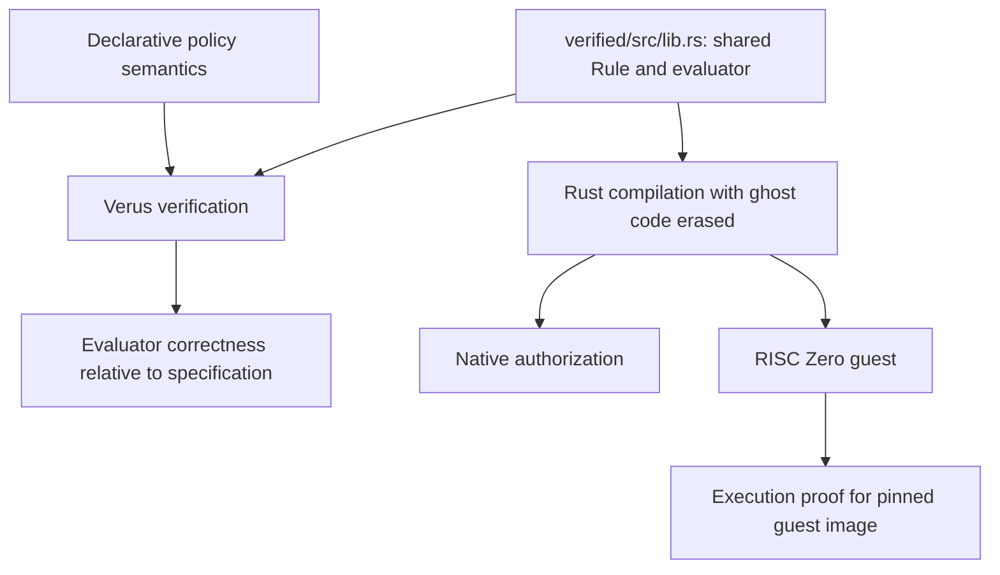

# Policy evaluator verification exercise

This crate contains the **actual evaluator used by the native application and
RISC Zero guest**, together with its Verus specification and proofs. The
subsequent [task escrow design](../task-escrow.md) defines agreement ownership and
settlement; those contracts are outside this evaluator proof.

## What is proved

`evaluate(rule, facts)` returns exactly `satisfies(rule, facts)` for every rule
tree and facts value. The specification defines `all` with universal
quantification, `any` with existential quantification, categories with set-like
membership, amount limits with inclusive comparison, and identifiers with byte
equality. The executable evaluator uses recursive calls and short-circuit loops.
Verus checks their equivalence, loop bounds and termination.

No platform-specific integer-width assumption is added: Verus's default
[`usize` model](https://verus-lang.github.io/verus/guide/integers.html) covers both
32-bit and 64-bit widths, matching the guest and host respectively.

`contractor_policy_guarantees` additionally proves that the example conjunction
of acceptance, an amount cap and allowed categories implies all three conditions.
These are general properties, not proofs about just the demonstration fixtures.
Changing supported policy parameters does not require a new correctness theorem.

Empty `all` evaluates to true and empty `any` to false mathematically; the existing
outer validator rejects both before authorization. That validator is outside this
proof. The theorem supplies no validation or authentication guarantee on its own.

## Connection to executable code



`core` re-exports this crate's `Rule`; there is no copied rule tree or alternative
runtime evaluator. After its existing evidence checks, `authorize()` projects
request and evidence fields into `Facts` and invokes `evaluate()`. Both native
and guest builds use that path. The proof runner checks the same source without
the optional Serde/Clone/Debug/Eq derives; those generated implementations are
outside the proof. Ordinary Cargo builds erase specifications and proof code.

Verification and compilation are separate commands. A successful Cargo build is
not evidence that Verus ran. Record the verified source hash and guest image for
each release; rerun verification after edits. This exercise does not implement a
release approval mechanism or automatic proof gate.

## Reproduce

Install the platform-appropriate [Verus release 0.2026.09.20.aef82ed](https://github.com/verus-lang/verus/releases/tag/release/0.2026.09.20.aef82ed)
and its Rust toolchain. From `warrant/policy-execution`:

```sh
rustup toolchain install 1.98.1 --profile minimal
python3 verified/verify.py --verus /path/to/verus --mutations
RISC0_BUILD_LOCKED=1 cargo test -p warrant-policy -p warrant-host --release --locked -- --test-threads=1
```

The runner pins the verifier version, uses `--no-cheating` to prohibit project
assumptions and admitted/external proof bodies, and prints the source SHA-256.
Its optional mutation checks alter only executable logic and require genuine
postcondition failures. Compilation errors do not count as rejected bugs.
The application pins `vstd` to the matching release in both dependency locks.
Verus uses Rust 1.98.1; the guest still compiles with RISC Zero Rust 1.88.

For fresh execution receipts after rebuilding, use a new artifact directory so
previous image receipts remain intact. Set `WARRANT_RECEIPT_DIR` to that directory
when running the receipt tests; it must contain `request.json`, `alternative.json`
and their corresponding `.receipt` files. See the parent [demo commands](../README.md#build-and-test).

## Three-valued evaluation

`evaluate3(rule, facts3)` returns exactly `kleene(rule, facts3)`, a strong Kleene
reading of the same rules over facts whose optional parts may be unknown.
`decide` maps `Some(true)`, `Some(false)` and `None` to Allow, Deny and Ask.
`decision_sound` proves that Allow implies `satisfies` for **every** completion
of the unknown facts, and Deny implies it fails for every completion. The
converse does not hold: Ask can occur even when every completion happens to
agree, which is the conservative direction. Only Allow authorizes a payment.

## Verification outcome

On 2026-09-23, after adding the invoice atoms and three-valued evaluation, Verus
reported **16 verified, 0 errors** and all 14 executable mutations were rejected.
See [the 2026-09-23 record](verification-results.md).

On 2026-09-22, Verus reported **7 verified, 0 errors** with `--no-cheating`.
All eight executable mutations were rejected: reversed and exclusive amount
comparisons, acceptance bypass, conjunction and disjunction inversions, category
bypass, and skipped recipient or deliverable equality checks.
All 24 application tests pass, and two fresh real receipts verify for the guest
using this evaluator. See [recorded build and proof results](verification-results.md).

## Trust boundary

This proves the evaluator against our written specification. It does **not** prove
the English policy was translated correctly, the reviewer told the truth, or the
entire application is secure. The facts projection, policy validator, parsing,
serialization, commitments, signature checks, authorization construction and
future payment vault remain outside this verification scope.

The Verus implementation, SMT solver, imported standard-library specifications,
ghost erasure, Rust compiler and zkVM toolchain remain trusted dependencies.
`--no-cheating` does not remove those dependencies. The proof does not establish
resource availability or absence of stack exhaustion for arbitrary trees; the
application enforces its existing depth and size bounds.

Tool documentation checked on 2026-09-22:
[Verus overview](https://verus-lang.github.io/verus/guide/),
[Cargo and ordinary Rust builds](https://verus-lang.github.io/verus/guide/cargo_verus.html).
